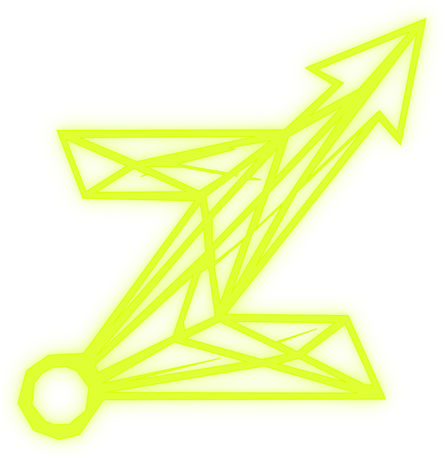

# ZEROUP — Content & Distribution Company

<div align="center">
  
  <h1>ZEROUP</h1>
  <p><strong>Build attention. Own distribution.</strong></p>
  <p><em>Modern media infrastructure & interactive creative-tech studio engineered for founders, breakout brands, and high-signal creators.</em></p>

  <p>
    <a href="https://github.com/rohitpal00015-prog/zeroup/stargazers"></a>
    <a href="https://github.com/rohitpal00015-prog/zeroup/network/members"></a>
    <a href="LICENSE"></a>
    
    
  </p>
</div>

---

## 📌 Executive Summary & Thesis

> **"Content is no longer just marketing. It is distribution infrastructure."**

ZEROUP operates at the intersection of **Content Strategy**, **High-End Studio Production**, **Creator Ecosystems**, and **Distribution Architecture**. We build content systems that turn expertise into attention, attention into audience, and audience into compounding, owned distribution channels.

### The Strategic Shift

```text
Traditional Advertising Pipeline (Decays to Zero):
Brand ──> Paid Ad ──> Rented Attention ──> Decays to 0

ZEROUP Media Infrastructure (Compounding Asset):
Brand / Expertise ──> Content Engine ──> Distribution ──> Audience ──> Trust & Data ──> Owned Media IP
```

---

## ✨ Key Interactive Studio Features

- **📖 3D Interactive Studio Book**: Built with pure CSS 3D perspective transforms. Features a leather-bound journal that flips open into a screenplay-style production manifesto and client showcase.
- **🎧 Procedural Web Audio Ambient Soundtrack**: Zero heavy audio files required. Uses a pure browser-native Web Audio API synthesizer generating meditative drone frequencies, binaural harmonics, and sub-bass textures on demand with a minimal floating sound controller.
- **⌨️ Interactive Creative Desk**: Dynamic desk objects (headphones, mechanical keyboard, clipboard, sticky notes, creator portraits) with cursor lift, glow physics, and interactive modal/routing triggers.
- **🌊 60 FPS Dotted Wave Terrain**: Real-time 2D Canvas wave simulation creating subtle, atmospheric depth behind hero typography without taxing the GPU.
- **⚡ Editorial Dark / Neon-Lime Aesthetic**: High-contrast dark palette (`#08090C`, `#0F1117`) anchored by electric signal lime accents (`#D4FF00`), paired with JetBrains Mono, Plus Jakarta Sans, and Caveat handwriting annotations.
- **📱 Fully Responsive & Accessible**: Gracefully adapts across mobile, tablet, laptop, and ultra-wide displays with touch-friendly fallbacks and reduced-motion support.

---

## 🗂️ Project Architecture & Directory Structure

```plaintext
zeroup/
├── index.html                   # Interactive Studio Homepage & Hero Desk Experience
├── about.html                   # About ZEROUP, Genesis Philosophy & Manifesto
├── services.html                # 7-Stage Media Engine & Service Architecture
├── case-studies.html            # Production Archives, Case Studies & Experiments
├── blogs.html                   # Research Dispatches & Editorial Essays
├── careers.html                 # Open Roles, Working Principles & Applications
├── contact.html                 # Distribution Inquiries & Project Brief Intake
│
├── soundtrack.js                # Native Web Audio procedural ambient synthesizer
├── wave-background.js           # Interactive 60fps Canvas dotted-wave simulation
├── studio-interactions.js       # Studio desk interactions, 3D book physics, key triggers
├── radar-sphere.js              # Vector sphere radar animation script
│
├── zeroup-icon.svg              # Official vector brand symbol
├── zeroup-logo.png              # Primary brand identity lockup
├── zeroup-full-logo.png         # Full high-res brand banner
│
├── app/                         # Next.js Application routes (optional React layer)
├── BUILD_SPEC.md                # Full technical specification & architecture spec
├── DESIGN_SYSTEM.md             # Color tokens, typography, and UI rules
├── CONTENT_ARCHITECTURE.md      # Editorial strategy & page content maps
├── PROJECT_BRIEF.md             # Core thesis, business context & grounding principles
├── package.json                 # Node dependencies and build scripts
└── README.md                    # Project documentation & setup guide
```

---

## 🚀 Quick Start & Local Development

You can run ZEROUP locally using any static web server or the Node.js development environment.

### Method 1: Instant Local Server (Recommended)

Using **Python 3**:
```bash
# Clone the repository
git clone https://github.com/rohitpal00015-prog/zeroup.git
cd zeroup

# Start a local static server on port 3000
python -m http.server 3000
```
Open [http://localhost:3000](http://localhost:3000) in your browser.

Using **Node / npx serve**:
```bash
npx serve -l 3000 .
```

Using **VS Code Live Server**:
- Open the folder in VS Code.
- Right-click `index.html` and select **"Open with Live Server"**.

---

### Method 2: Node.js & Next.js Environment

```bash
# 1. Install dependencies
npm install

# 2. Start local development server
npm run dev

# 3. Build for production
npm run build
```

---

## 🎨 Design System & Color Tokens

| Token | Hex Code | Preview | Usage |
| :--- | :--- | :--- | :--- |
| **`bg`** | `#08090C` | `■` | Deep Obsidian background |
| **`surface`** | `#0F1117` | `■` | Card containers & modal surfaces |
| **`surfaceHover`**| `#161922` | `■` | Elevated cards on hover |
| **`accent`** | `#D4FF00` | `■` | Electric Signal Lime (Primary CTA & highlights) |
| **`textPrimary`** | `#FFFFFF` | `■` | Headings & high-emphasis copy |
| **`textSecondary`**| `#94A3B8` | `■` | Body paragraphs & technical descriptions |
| **`textMuted`** | `#64748B` | `■` | Meta timestamps & subtle captions |

---

## 🌐 Deploying to Production

### Deploy on Vercel
1. Import repository `https://github.com/rohitpal00015-prog/zeroup` into [Vercel](https://vercel.com).
2. Framework Preset: **Other** (or **Next.js**).
3. Root Directory: `./`.
4. Click **Deploy**.

### Deploy on GitHub Pages
1. Go to repository **Settings** → **Pages**.
2. Under **Build and deployment**, select source: **Deploy from a branch**.
3. Branch: `main` / Folder: `/ (root)`.
4. Click **Save**.

### Deploy on Netlify
1. Drag and drop the root folder into [Netlify Drop](https://app.netlify.com/drop) or link via GitHub.
2. Publish directory: `./`.

---

## 📄 Documentation

For deep dives into the strategic architecture, design system, and technical specifications, explore:
- [`PROJECT_BRIEF.md`](PROJECT_BRIEF.md) — Genesis, anti-positioning, audience definitions, and core thesis.
- [`DESIGN_SYSTEM.md`](DESIGN_SYSTEM.md) — Visual rules, color tokens, layout grids, and interactive patterns.
- [`BUILD_SPEC.md`](BUILD_SPEC.md) — Complete 7-page production blueprint and technical requirements.
- [`CONTENT_ARCHITECTURE.md`](CONTENT_ARCHITECTURE.md) — Copywriting manifests, section flows, and CTAs.

---

## ⚖️ License

Distributed under the **MIT License**. See [`LICENSE`](LICENSE) for more information.

---

<div align="center">
  <p>© 2026 <strong>ZEROUP</strong>. Built with precision in Prayagraj, India 🇮🇳.</p>
  <p><em>Attention is engineering. Distribution is owned.</em></p>
</div>
